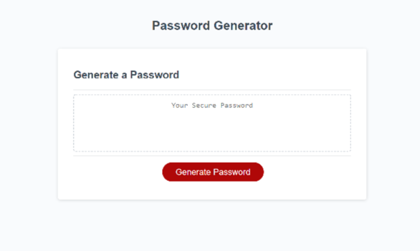

# Password Generator
## Module 3 challenge

### Purpose

This is an application that generates a random, secure password between 8-128 characters in length. The password can be composed of between 1-4 character types including upper case, lower case, numbers, or special characters.

The user will be prompted to select a preferred password length. They will then be prompted to select at least one character type to include in the password. Each chosen character type will be validated after its selection.

The randomized password is displayed in a window after the final character type prompt is answered.

### Built With

- HTML
- CSS
- JavaScript

### Website

https://evelynaguirreortiz.github.io/javascript-password-generator-challenge-utsa-bc-02-2022/

